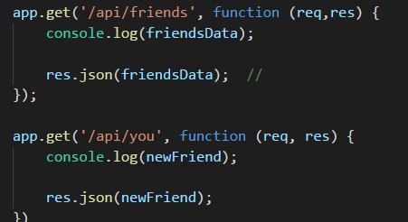

Looking to find that special someone?&nbsp; Look no further!&nbsp; This Friend Finder application is a dating app to assist with all your relationship needs. 
 
 
 
This is a full stack application that takes in results from users surveys and then compares their answers with those from other users.&nbsp; The app will then display the name and picture of the user with the best overall match.
 
 

Express js handles the routing for us along with body parser and path dependencies. &nbsp;The body parser is considered middleware. &nbsp;It parses incoming request bodies in a middleware before the handlers.&nbsp; Express provides small tooling for HTTP servers which makes it ideal for our website application when navigating. 
 
 

 
Here is an example of a get request in our api-routes file:  We use the get function routing to the variable friends located in our friends.js directory. &nbsp;Inside the function there is a request and a response (function(req,res)). &nbsp;We console.log the friendsData variable and json turns this object into a string for us to use in our application.
 
 
  I deployed my application through Heroku.
 Happy Hunting!
